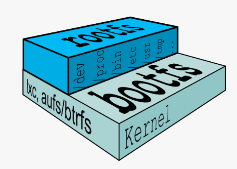
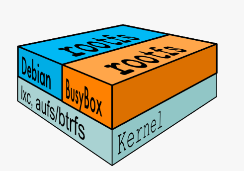
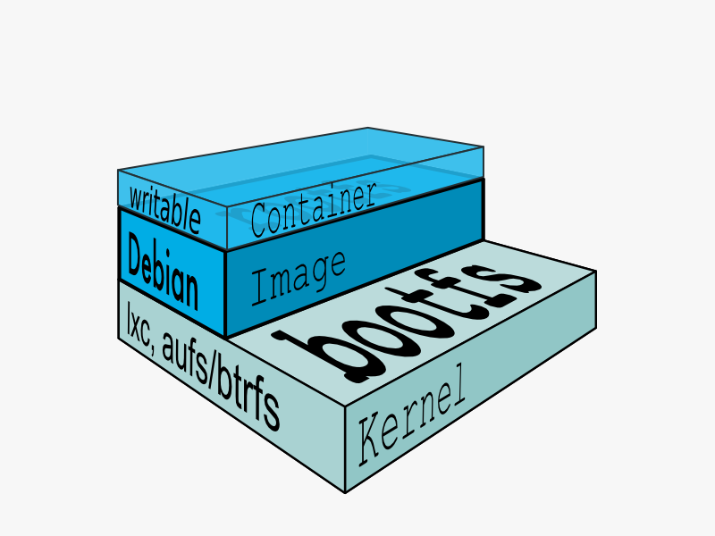

# Docker 背后的内核知识
对于容器类应用而言，资源隔离和资源限制、网络通信都是实现容器时比较重要的部分。这里分别讲述。

## Namespace
namespace 将一些系统资源进行封装，并使这些资源与其他系统资源隔离。namepsace 中各资源的进程互相可见，但对 namespace 外的进程不可见，Linux 提供了如下几种 namespace：

  Namespace |  Constant  |  Kernel  |Isolates 
-----------|--------------|-------|----------
 Mount   |  CLONE_NEWNS  | Linux 2.4.19 | 挂载点
 IPC     |  CLONE_NEWIPC | Linux 2.6.19 | 信号量，POSIX 消息队列
 UTS     |  CLONE_NEWUTS | Linux 2.6.19 | 主机名和域名
 PID     |  CLONE_NEWPID | Linux 2.6.24 | 进程 ID
 Network |  CLONE_NEWNET | 始于 Linux 2.6.24，完成于 Linux 2.6.29 | 网络设备，网络栈，端口等
 User    |  CLONE_NEWUSER | 始于 Linux 2.6.23，完成于 Linux 3.8 | 用户和用户组
 Cgroup  |  CLONE_NEWCGROUP |v1: Linux 2.6.24；v2: Linux 3.10  | Cgroup 根目录
  
Cgroup 后面再说，这里先谈其他 6 个 namespace。

Namespace API 主要有3个：
- clone  
  通过指定的 CLONE_NEW* 参数来创建相应的进程。
- setns  
  允许进程加入到某个 namespace 中，namespace 根据 `/proc/[pid]/ns` 的文件描述符指定。
- unshare     
  将进程移动到一个新 namespace 中，同时与之前的 namespace 解绑。

另外 /proc 目录下也有一些与 namespace 相关的文件。在 `/proc/[pid]/ns/` 目录中，可以看到一些符号链接：

- /proc/[pid]/ns/ipc (since Linux 3.0)
- /proc/[pid]/ns/uts (since Linux 3.0)
- /proc/[pid]/ns/net (since Linux 3.0)
- /proc/[pid]/ns/mnt (since Linux 3.8)
- /proc/[pid]/ns/pid (since Linux 3.8)
- /proc/[pid]/ns/user (since Linux 3.8)
- /proc/[pid]/ns/cgroup (since Linux 4.6)
- /proc/[pid]/ns/pid_for_children (since Linux 4.12)

如果两个进程指向的 namespace 编号相同，则说明它们是在同一个 namespace 中。在 Docker 中，通过文件描述符定位和加入一个存在的 namespace 是最基本的方式。

在 `/proc/sys/user` 目录下，可以看到 namespace 的一些参数配置。

这里说下 network namespace，其只是把网络独立出来，给外部用户一个透明的感觉。一般做法是创建一个 veth pair，一端放在新的 namespace 中，通常命令为 eth0，另一端放在原先的 namespace 中连接物理网络设备，再通过把多个设备连入网桥或进行路由转发，来实现通信。在建立起 veth pair 前，新旧 namespace 通过 pipe 来通信，等 veth 连接建立起来后，再关闭管道。

## Cgroups

Namespace 解决了环境隔离的问题，Cgroups 用来解决资源限制的问题。Cgroups 是 Linux 内核为了对一组进程进行统一的资源监控和限制。可以将 cgroups 理解成内核加在程序上的一系列钩子，通过对程序运行时的资源调度触发相应的钩子来达到资源追踪和限制的目的。Cgroups 有两个版本：[v1](https://www.kernel.org/doc/Documentation/cgroup-v1/cgroups.txt) 和 [v2](https://www.kernel.org/doc/Documentation/cgroup-v2.txt)。v1 从 Linux 2.6.24 开始发布，不过随着越来越多 controller 的加入，使 controller 的开发变成不太协调，进而引起 controller 和 cgroup hierarchies 之间的不一致。因此在 Linux 3.10 时，提出了 v2 版本，并于 Linux 4.5 正式发布，不过由于兼容性问题 v1 不大可能被移走，所以现在 v2 相关于 v1 中一个 controller 的实现，虽然一个 controller 可能既支持 v1，也支持 v2，不过同一时间只能使用一个版本的 cgroups。由于目前主流(docker, systemd等)仍使用 v1，因此这里主要说 v1。

v1 用来的几个术语如下：
- task     
  在 v1 中，一个进程由多个 task 组成（即线程），task 能独立操作进程间关系，不过这种能力会导致了一些问题，因此在 v2 中移除了这种能力，只能进程操作进程之前的关系。
- cgroup     
  通过 cgroup 文件系统限制资源的进程集合。cgroups 中的资源控制以 cgroup 为单位实现。
- subsystem     
  subsystem 是一个可以修改 cgroup 中进程行为的内核组件。常见的 subsystem 包括限制 CPU 时间，可用的 Memory 大小，挂起和恢复进程等。subsystem 有时也被称为 resource controllers，或 controllers 。
- hierarchy（层级）    
  hierarchy 由一系列 cgroups 以目录树结构排列组成，通过创建、移动、重命名 cgroup 文件系统中的子目录来定义层级。每层 hierarchy 都可定义属性。

在 cgroups v1 中，每个 controller 都能挂载在不同的 cgroup 文件系统中。不同的 controller 也能挂载在同一 cgroup 文件系统中。一般挂载在 tmpfs 文件系统中的 `/sys/fs/cgroup` 目录。 对于已挂载的 controller，其目录树对应 cgroup 的 hierarchy。每个 cgroup 代表一个目录，其子 cgroup 则代表其子目录。每个 cgroup 目录中有一系列文件对应 cgroup 各项属性。

v1 中的 controllers 各类如下：
- cpu    
  当系统繁忙时，cgroup 能保证使用的最少 cpu 数。当系统不繁忙时，不会限制 cpu 使用。
- cpuacct    
  计算 cpu 使用率。
- cpuset    
  将进程绑定到 CPUs 和 NUMA 节点。
- memory    
  监控和限制进程内存，内核内存，cgroups 使用的swap。
- devices   
  控制进程使用的设备。能设置白名单和黑名单。
- freezer    
  freezer cgroup 能挂载和恢复 cgroup 中的所有子进程。
- net_cls        
  将 classid 放到 cgroup 中的网络包中。这些 classid 能用于防火墙规则。
- blkio           
  限制设备的 I/O。
- perf_event      
  cgroup 中进程的 perf 监控。
- net_prio       
  网卡的优先级。
- hugetlb        
  限制 cgroups 使用的 hugepage。
- pids        
  限制 cgroups 创建的进程数。

这些属性可以`/proc/cgropus` 中查看到。如下：
```
$ cat /proc/cgroups
#subsys_name    hierarchy    num_cgroups    enabled
cpuset          0            1              1
ns              0            1              1
cpu             0            1              1
cpuacct         0            1              1
memory          0            1              1
devices         0            1              1
freezer         0            1              1
net_cls         0            1              1
blkio           0            1              1
perf_event      0            1              1
```

第一列是属性名，第二列是挂载的层级 id，第三列是该层级使用该 controller 的 cgroup 数，第四列若 controller 开启则为1，否则为0。

`/proc/[pid]/cgroup` 定义了该进程对应的 cgroup。其内容为 `hierarchy-ID:controller-list:cgroup-path`。

`/` 是根 cgroup，所有进程都归属于这个 cgroup。通过在 cgroup 文件系统中创建目录来可创建一个新的 cgroup，如`mkdir /sys/fs/cgroup/cpu/cg1`。通过将进程 id 写到 cgroup 的 cgroup.procs 文件中可将该进程移动到这个 cgroup，如`echo $PID > /sys/fs/cgroup/cpu/cg1/cgroup.procs`。如果想移除 cgroups 的话，该 cgroups 必须没有任何子 cgroups，并不包括任何进程。

### Cgroups V2

cgroups v2 同 v1 有如下区别：
- 所有 controllers 都位于统一的层次中。
- 必须通过 cgroup.controllers 和 cgroup.subtree_control 来指定活动的 cgroups。
- 移除了 tasks 文件。
- 当 cgroup 为空时可通过 cgroup.events 来获取通知。

## Union FileSystems
[UnionFS](https://en.wikipedia.org/wiki/UnionFS) 允许不同文件系统的目录或文件（被称为 branch）合并 mount 为一个虚拟文件系统目录。branch 可以为 read-only 或 read-write 权限的。当读取该虚拟文件系统时，同名文件根据 branch 优先级读取。当对这个虚拟文件系统的目录进行写操作时，看起来是该虚拟文件系统能对任何文件进行操作，实际是对权限为 read-write 权限的 branch 进行写操作。

Docker 最开始使用 AUFS 文件系统做为存储，虽然后来版本改用其他文件系统，不过这里仍以 AUFS 为例子讲解 UnionFS。AUFS 基于 UnionFS 实现，并引入了一些新的功能。AUFS 的branch 可以是 read-only, read-write 或 whiteout-able 等权限。对于 read-only 目录只能读，写操作都是在 read-write 目录进行，重点在于，写操作是在 read-only 层上的一种增量操作，不影响 read-only 目录。挂载目录严格按照各目录间的增量关系，将被增量目录优于增量目录挂载，即最上层目录始终是 read-write 属性。


典型的 Linux 启动需要运行两个 FS -- bootfs 和 rootfs。



- bootfs 主要包含 bootloader 和 kernel，bootloader 引导加载 kernel，kernel 被加载到内存后 bootfs 就被 umount 了。
- rootfs 包含的就是典型的 Linux 系统中的 /dev, /proc, /bin, /etc 等标准目录。

不同 Linux 发行版，bootfs 基本一致，rootfs 会有差别。因此不同发行版结构如下图：



Linux 在启动后，首先将 rootfs 设置为read-only，然后进行一系列检查，然后将其切换为 read-write 供用户使用。在 Docker 中，起初也是将 rootfs 以 read-only 方式加载也并检查，然后利用 UnionFS 将一个 read-write 的文件系统挂载在 read-only 的 rootfs 之上，并允许再次将下层的文件系统设置为 read-only 向上叠加，这样一组 read-only 和一个 read-write 文件系统构成一个 container 的运行目录，每一层被称为一个 Layer。如下图：


由于 AUFS 的特性，每一个对 read-only 层的修改都只存在于上层的 read-write 层中，这样多个 container 可以共享 read-only 的 layer，因此在 docker 将 read-only 层称为 image 。对于整个 container 而言，整个 rootfs 都是 read-write，虽然实际上修改只写入最上层的 read-write 层。


上层 image 依赖下层 image，即下层 image 被称为父 image，没有父 image 的 image 被称为 base image。


因此想要从 image 启动 container，docker 先加载父 image 直到 base image，用户的进程运行在 read-write 的 layer 中，所有父 image 中的数据信息及 ID，网络等具体 container 配置，构成一个 container，如下：


## 参考
- [NAMESPACES man](http://man7.org/linux/man-pages/man7/namespaces.7.html)
- [Resource management: Linux kernel Namespaces and cgroups](https://www.cs.ucsb.edu/~rich/class/cs293b-cloud/papers/lxc-namespace.pdf)
- [CGROUPS](http://man7.org/linux/man-pages/man7/cgroups.7.html)
- [CGROUPS](https://www.kernel.org/doc/Documentation/cgroup-v1/cgroups.txt)
- [Control Group v2](https://www.kernel.org/doc/Documentation/cgroup-v2.txt)
