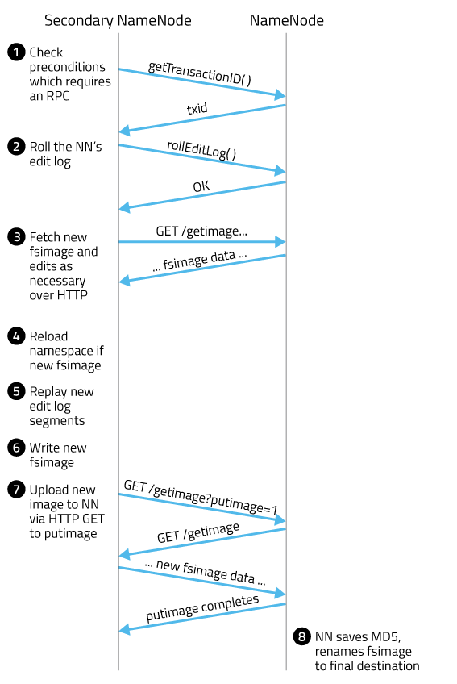

HDFS
===

这里记录下HDFS中一些容易混淆和一些需要注意的地方。

Secondary NameNode, CheckPoint Node, Backup Node 和 Standby NameNode 的区别
---

在说这些节点区别时，先说下NameNode的启动过程：
### NameNode启动过程

FSImage文件包含文件系统中所有目录、文件的序列化信息和数据块的映射信息，edits记录了集群所有的变更操作。当NameNode启动时，会加载fsimage和edits来生成一个新的fsimage，之后群集的变更都会更新到edits中。

- Namenode 从FSImage中读取系统元数据
- 读取Edits，将文件变更操作应用在文件系统的元数据上
- 新写一个 checkpoint（即当前FSImage与Edits合并）
- 进入安全模式，直到各datanode报告足够的block为止。（[默认情况](https://hadoop.apache.org/docs/r2.3.0/hadoop-project-dist/hadoop-hdfs/hdfs-default.xml)下，datanode报告的block为元数据记录的block的0.999倍即退出安全模式）

Hadoop中有几种提供CheckPoint的方法，如下。

### Secondary NameNode
随着edits的增加，当Namenode重启时，花费在合并edits与fsimage上的时间会很多，这是Secondary NameNode产生的原因。Secondary NameNode 并不是Hadoop HA的备用NanmeNode。在Hadoop2之前，它是唯一一个checkpoint进程。

Secondary NameNode周期性检查NameNode的 fsimage 和 edits是否需要合并，如果需要合并的话，其先触发edit roll，然后下载NameNode中的fsimage和edits文件进行合并生成新的 fsimage，再将新的 fsimage 上传给 Namenode。Secondary NameNode通常和NameNode不是运行在一个节点上。Secondary的checkpoint进程由 `dfs.namenode.checkpoint.period` 和 `dfs.namenode.checkpoint.txns` 两个参数共同控制。过程如下：

当需要使用Secondary NameNode恢复数据时，将其数据拷贝到NameNode即可。但Namenode中在snn做最后一次的checkpoint之后的edits需要重放。

### Checkpoint Node
因为Secondary NameNode 给人带来混淆，后面版本中使用Checkpoint Node 用来代替Secondary NameNode。其作用和配置和Secondary Namenode 一样。

Checkpoint Node使用命令 `bin/hdfs namenode -checkpoint` 启动，Checkpoint 节点位置由`dfs.namenode.backup.address`和`dfs.namenode.backup.http-address`决定。Checkpoint Node 启动checkpoint的条件同snn触发条件。

### Backup Node
Backup Node除了提供和Checkpoint Node一样的Checkpoint功能外，还从 NameNode 接收journal流文件形式的edits，并持久化到磁盘，同时将这些edits加载到内存中，这样便在内存中还维持了一份和当前Namenode *实时同步* 的文件系统命名空间（因此Backup Node内存应和Active Namenode大小一样）。因此当有Backup Node时，可以不需要使用Checkpoint node。Backup Node 不需要从Namenode下载fsimage和 edits，因此做checkpoint时效率比SNN或Checkpoint Node高很多。

Backup Node的缺点：1）不具热备性：Namenode发生问题时，还需要手动重启NameNode。2）Backup Node没保存block的信息，若切到Backup Node做namenode，仍需要datanode上报各自block位置，因此，即使后续版本实现热备，切换仍需要时间。3）当前一个NameNode只支持一个Backup Node，未来可能会考虑支持多个Backup node。

启动Backup node的命令为`bin/hdfs namenode -backup`，Backup node节点位置由`dfs.namenode.backup.address`和`dfs.namenode.backup.http-address`决定。

### Standby Namenode
在HA结构中的任何时间点，保证只有一个active的namenode和一个standby的namenode，active namenode负责集群所有操作，standby仅做热备。namenode的切换通过ZKFC机制实现。每个namenode上均存在ZKFC进程，ZKFC通过心跳通信检测NameNode状态是否发生变化。

目前有两种实现形式的HA: 1) Journal Node。namenode将edits写到大多数(N/2+1)journal node节点中，standby 去读取这些edits并执行，这样使得active nn和standby nn的元数据处于同一状态。 2) NFS。active和standby对NFS有同样的权限, active namenode将edits写到NFS，然后standby去同步edits并执行，使用active nn和standby的元数据处于同一状态。这种方式对NFS设备要求较高，网络，磁盘，电源等都需要做冗余。

Reference
---
- [HdfsUserGuide](http://hadoop.apache.org/docs/current/hadoop-project-dist/hadoop-hdfs/HdfsUserGuide.html#Secondary_NameNode)
- [A Guide to Checkpointing in Hadoop](http://blog.cloudera.com/blog/2014/03/a-guide-to-checkpointing-in-hadoop/)
- [High Availability for the Hadoop Distributed File System (HDFS)](http://blog.cloudera.com/blog/2012/03/high-availability-for-the-hadoop-distributed-file-system-hdfs/)
- [HDFS High Availability Using the Quorum Journal Manager](http://hadoop.apache.org/docs/current/hadoop-project-dist/hadoop-hdfs/HDFSHighAvailabilityWithQJM.html)

