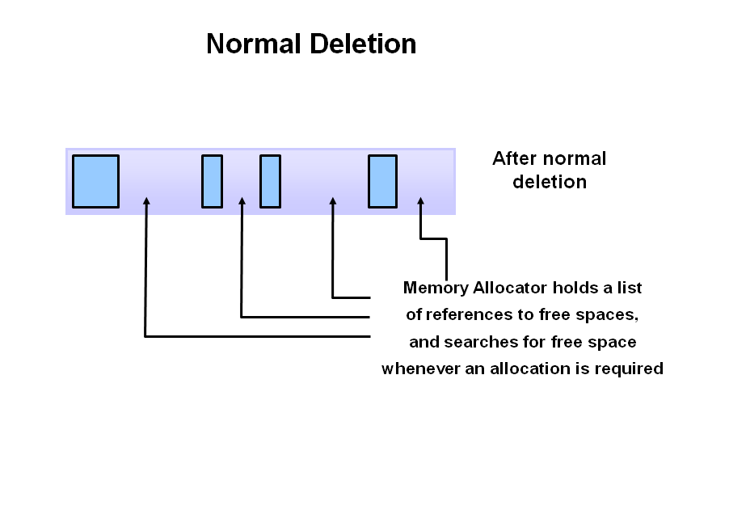
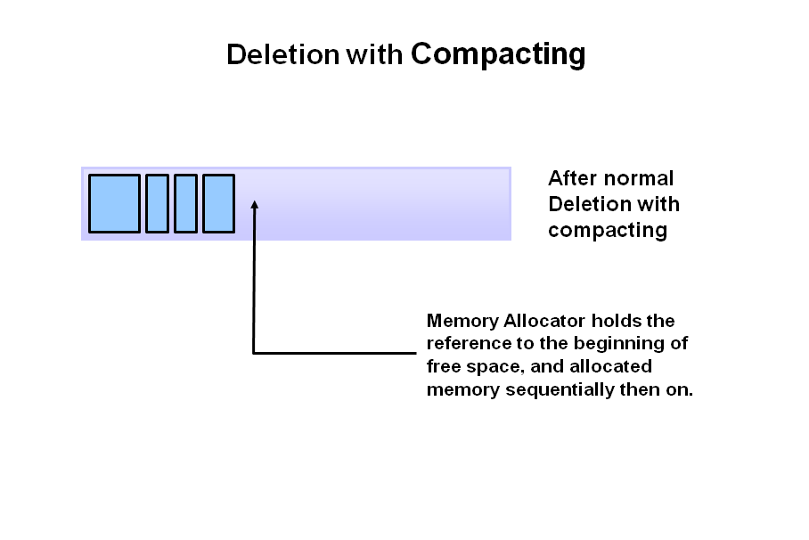
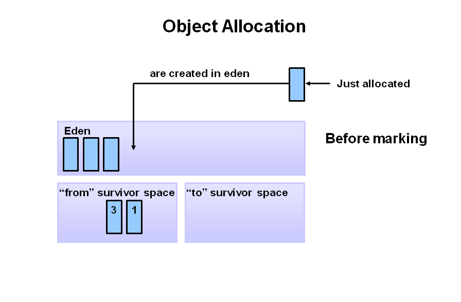
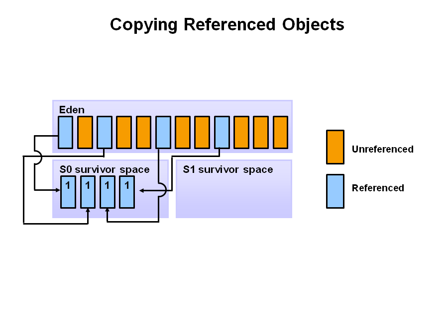
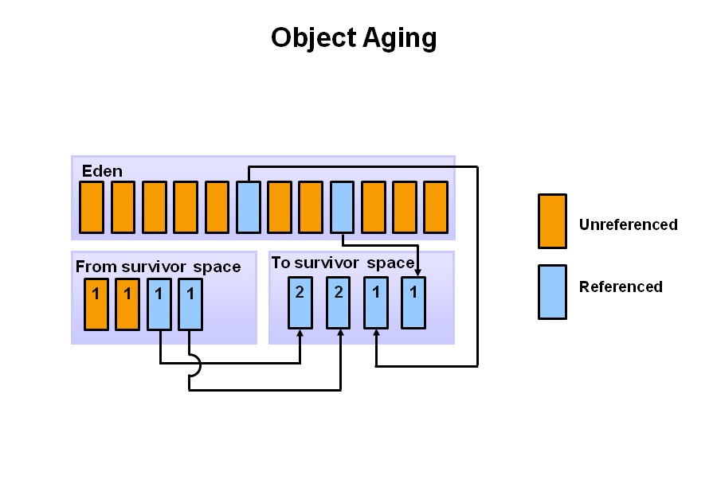
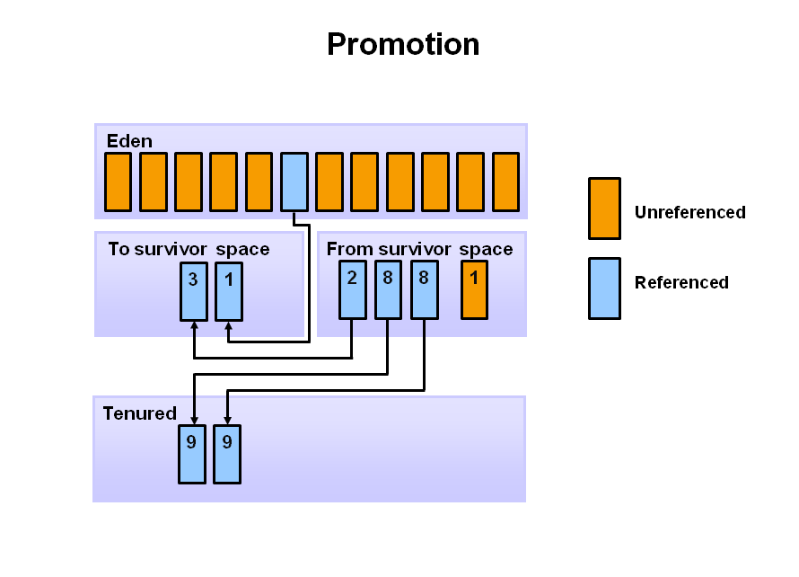
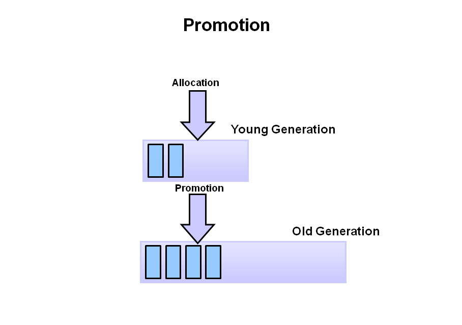
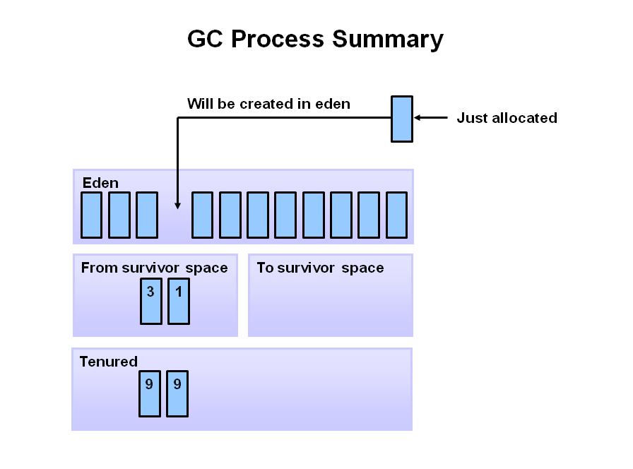

JVM 概况
---

在 Java 中，程序员一般不需要专门编写内存回收和垃圾清理的代码，这里因为 JVM 中存在自动内存管理机制。目前有3大 JVM: Sun Hotspot, Oracle JRockit, IBM JVM，而在 Oracle 收购 Sun 之后，默认的 JVM 是 Hotspot。因此下面的介绍都是基于 Hotspot JVM。

注：以下内容基于官方文档。

JVM Architecture
---
JVM 主要包括如下部分： `Classloader`, `Runtime data areas`, `Execution engine`。这三者关系如下图：

其中优化最多的是 `Heap` 大小和使用适当的 `Garbage Collector`。虽然 `JIT Compiler` 对性能的影响也大，但对于新版本的 JVM 而言，其很少需要被优化。 

Performance Basic
---
一般而言，当调优一个 Java 应用时，最主要的目标集中在响应（responsiveness）或产量（throughput）两方面。

响应指系统或应用对请求响应的速度，如包括以下方面：
- 桌面UI对事件响应速度
- website返回页面的速度
- 数据库查询的速度
若应用对响应速度要求很高，那么较长的暂停时间（pause time）是无法被接受的。 

产量指应用在一段时间内完成的工作数，如包括如下几个方面：
- 指定时间内完成的事务数
- 指定时间内一批程序能完成的任务数
- 指定时间内完成的数据库查询数 
对产量要求高的应用，对较长的暂停时间是可以接收的，其对快速响应是不要求的。

JVM 分代
---
 在实际应用程序中，发现大多数对象存活时间都较短，如下图：   
 _y轴是对象存活的字节数，x轴是随着时间变化的分配的字节数_

可以看到，随着时间的推移，越来越少的对象在占用内存。考虑到这点，JVM 被设计为分代的结构。JVM 将对象分为3部分分别管理：Young Generation(年轻代), Old or Tenured Generation(年老代), Permanent Generation(永久代)。其中 Heap 被分为 Young Generation 和 Old Generation，而 `Method Area` 定义为 Permanent Generation。

Young Generation 是所有新对象产生和生成的地方。当年轻代装满对象后，会引起一次 `minor garbage collection`。 `minor garbage collection` 剔除过期对象，并最后将存活的对象移到 Old Generation 中。所有的 `minor garbage collection` 都会造成 Stop the World Event，这意味着所有应用的线程都会暂停，直到 gc 完成。

Old Generation 用来存储存活时间较长的对象。一般而言，Young Generation 中的对象都有一个阈值，当对象的年龄到达这个阈值时，将该对象移到 Old Generation 中，当 Old Collection 被填满时，会触发 `major garbage collection`。 `major grabage collection` 也会触发 Stop the world Event，并且其更缓慢，因为它包含了所有活着的对象。所以对于响应型应用，需要最小化 Old Generation 的影响。另外说一下， **`major garbage collection`的时间长短受所使用的 garbage collector 影响** 。

Permanent Generation 包含用于用于描述类和方法的元数据。Java SE 库的类和方法可能位于其中。若部分类不再使用，在 `full garbage collection` 中，Permanent Generation 中这些数据也会被回收。

Garbage Collection 过程
---
先说下自动垃圾回收的过程。  
1. Marking    
  标记哪些内存块在使用，哪些没有在使用。   
  
2. Normal Deletion     
  正常删除未被引用的对象，保留被引用的对象。内存分配器维护空内存块，以便新对象的分配.
  
2.a Deletion with compacting  
为提高性能，除了删除被引用对象，还可能压缩被保留的对象。  

以上是堆中自动垃圾回收的过程，接下来看下 generational garbage Collection 的大致过程。

在 JVM 分代中已经提到过，Young Generation 是所有新对象产生的地方。而hotspot中 Young Generation 又可以分为三部分: eden, S0, S1(S0, S1 统称为 Survivor 空间).

1. 新对象在 eden 区域分配，两个 survivor space 都为空。   

2. 当 eden 区域填满时，触发 `minor garbage collection`。   

3. 被引用的对象被移到第一个 survivor 空间，未被引用的对象被删除。

4. 在下一次 eden 区域发生 `minor garbage collection` 时，未被引用的对象被删除，而被引用的对象被移到另一个 survivor 空间(S1)中。同时，第一个 survivor 空间（S0）中仍活的对象也移到S1中，同时其年龄增加。这时所有对象都在S1中，而 eden 和 S0 的为空。

5. 再下一次 `minor garbage collection` 时，处理流程与上面一样，只不过 survivor 空间从S1换为S0，仍然活着对象的年龄加1。

6. 在若干次 `minor garbage collection` 后，Young Generation 中对象的年龄达到阈值。它们从 Young Generation 迁移到 Old Generation。

7. `minor garbage collection` 不断被触发，Old Generation 中的对象不断增加

8. 足够多次的`minor garbage collection`后，Old Generation的对象越来越多，最终会在 Old Generation 进行一次`major GC`来清理和压缩空间。

_在 hotspot 版的JVM中，仅在 Old Generation 中才有压缩(compact)操作，因为hotspot认为 young generation 仅仅是一个copy collector，没必要压缩。_

Garbage Collector
---

在 Java 中，有许多不同的命令行开关(command line switch)，下表是 JVM 中一些常见的设置命令：

 Switch | Description
--------|--------------
 -Xms   | JVM 启动时，设置初始堆大小
 -Xmx   | 设置堆的最大值
 -Xmn   | 设置 Young Generation 的大小
 -XX:PermSize | 设置 Permanent Generation 的起始大小
 -XX:MaxPermSize | 设置 Permanent Generation 的最大值

以下是各种 Garbage Collector。

### Serial Collector

在 serial collector 中，minor gc 和 major gc 都是串行（仅使用一个虚拟cpu）执行的。young generation 中的垃圾回收算法如 generation gc 中描述的一样，在 eden ,survivor 1 和 suvivor 2 中交换对象，此不赘述。而 old generation 和 permanent generation 垃圾回收使用的是 `mark-sweep-compact` 算法，在 `mark` 阶段，标记仍然存活的对象，在 `sweep` 阶段，清理未标记的对象，在 `compact` 阶段，将 old/permanent generation 存活的对象都移动到开头的一侧，剩下来一串连续未分配的内存块。

serial collector 在 client-style 的机器中Java SE 5 和 6 是默认的Garbage Collector。因此对于 client-style 机器中对暂停时间不要求太短的应用而言，serial collector 是一个选择。另外，由于 serial collector 使用一个cpu，所以对于一些对硬件要求高的机器而言，serial collector 也是一个不错的选择，如一台机器中jvm数大于机器可用的 CPU 数和嵌入式环境中。

开启 serial collector 的命令是 `-XX:+UseSerialGC`。如使用 serial collector 的一个应用: `java -Xmx12m -Xms3m -Xmn1m -XX:PermSize=20m -XX:MaxPermSize=20m -XX:+UseSerialGC -jar javademos/demo/jfc/Java2D/Java2demo.jar`.

### Parallel Collector

parallel collector 使用多线程来完成 Young Generation 中的垃圾回收，算法和 serial collector 中 young generation 垃圾回收算法一样。默认情况下，若一台机器有N个cpu核，那么 parallel collector 会使用 N 个垃圾回收线程。old generation 中的垃圾回收算法和 serial collector 中一样，都是 `mark-sweep-compact`。因此 parallel collector 得到的是一个多线程的 young generation collector 和一个单线程的 old generation collector，还有一个单线程来完成 old generation 的压缩。

parallel collector 适用于任务量大且能容忍较长暂停时间的情况，如批处理和大量的数据库查询。因此 parallel collector  也叫 throughput collector。

开启 parallel collector 的命令是 `-XX:+UseParallelGC`。

### Parallel Compacting Collector

parallel compact collector 中的 young generation 的垃圾回收算法和 parallel collctor 中 young geneartion 算法一样，都是使用的多线程。而 old generation 中使用 `mark-summary-compaction` 来完成垃圾回收。在 `mark` 阶段，old generation 中对象根据gc线程数分为几个逻辑块，然后 gc 线程并行标记各自负责块中的存活对象，如果一个对象是活的话，那么这个块中关于该对象大小和位置的信息都会更新。`summary` 阶段操作的是先前划分的逻辑块，而不是其中的数据。一般而言，部分 generation 的左边存活对象是很多的，对这些块的压缩是不值得的。所以在 `summary` 阶段最开始是从逻辑块最左边开始检查存活对象数，当某个块中能回收的空间到达一定值后，则认为该块及该块右边的块都是能被回收的。此时，该块左边块的活动对象是密集的，不会有对象移动到这些块去，该块及其右边块，都会回收空间并压缩。summary 目录仍是串行的，虽然并行可以实现，但远不如 `mark` 和 `compaction` 阶段的并行重要。 在 `compaction` 阶段，根据 `summary` 阶段得到的数据识别哪些块是需要填充的，各个 gc 线程将数据 copy 到这些块中。整个过程导致 old generation 的一端密集一端空闲。

Parallel Compacting Collector 相比 Parallel Collector 而言，减少了暂停时间。其开启命令是 `-XX:+UseParallelOldGC`。另，可以设置使用的线程数: `-XX:ParallelGCThreads=<desired number>`

### Concurrent Mark-Sweep (CMS) Collector

Young generation 的暂停时间一般不会太长，但是对于 old generation，特别是在 Heap 很大的情况下，垃圾回收会造成较长的暂停时间，为解决这个问题，Hotspot JVM引入了 CMS collector。 Young generation 的垃圾回收和 parallel collector 中一样。而 old generation 所使用的方法如下：首先是一个短暂的暂停，称之为 `initial mark`, 这个阶段识别出仍被应用引用的存活对象，接着是 `concurrent mark` 阶段，这个阶段 collector 会标记所有存活对象，而此时应用仍在运行，这不能保证所有活动对象都被标记出来，所有还需要一次暂停来标记所有对象，这个阶段称为 `remark`, 由于这个阶段比 `initial mark` 更为重要，所以这里使用的是多线程，`remark`之后，所有存活对象都被标记出来了，最后一步是 `concurrent sweep` 阶段，这个阶段会并发清除过期对象。

因为标记的过程中，应用程序仍在分配对象，因此 old generation 也仍在增大，所以 cms collector 需要更大的heap空间。另外 cms 是唯一一个没有压缩的 collector ，其减少了暂停时间，但也导致heap中容易出现碎片。为了解决这个问题，cms 会跟踪 popular 对象的大小，来预估未来的需求，并可能分割或合并空闲块来满足需求。和其他collector 不同的是，cms collector 不会等到 old generation 满了才运行内存回收，可以设置在某个值进行内存回收，该值通过 `–XX:CMSInitiatingOccupancyFraction=n` 来设置。n的默认值 68，即68%。

### Garbage-first(G1) collector
因为 cms collector 在使用更多的硬件资源，heap 量等，所以Java 7 之后引入G1 collector 来代替CMS collector。G1 吸收上述 collector 的优点，将堆区分为一个一个等大小的逻辑块（region），内存的回收和分配都以逻辑块为单位，同时，和 cms collector 中一样，将回收过程分阶段完成。 G1 collector 先扫描所有逻辑块，按存活对象的大小排序，当需要回收内存时，先回收存活对象小的块，这也是其被称为 grabage first 的原因。

设置`-XX:+UseG1GC` 使用 G1 collector。 

Observation
---
这里稍微说下用来查看 jvm 的一些命令。

### jstat

jstat 可以查看 jvm 中各个 generation 的情况。调用 jstat 的命令 `jstat -<option> [-t] [-h<lines>] <vmid> [<interval> [<count>]]`。其中 vmid 可以通过 jps 或者 ps axuf |grep java 看到，是对应 jvm 的进程id。如 `jstat -gc 18889 1s 10`，查看id为18889的进程的jvm情况，每1s输出一次，共输出10次。

对 jstat 输出结果的说明：

 列   | 说明      
------|---------
 S0C  | Survivor0空间的大小，单位KB。
 S1C  | Survivor1空间的大小，单位KB。
 S0U  | Survivor0已用空间大小，单位KB。
 S1U  | Survivor1已用空间大小，单位KB。
 EC   | Eden空间大小，单位KB。
 EU   | Eden已用空间大小，单位KB。
 OC   | old generation 空间大小，单位KB。
 OU   | old generation 已用空间大小，单位KB。
 PC   | permanent generation 空间大小，单位KB。
 PU   | permanent generation 已用空间大小，单位KB。
 YGC  | young generation GC 发生次数。
 YGCT | young generation GC stop the world 的时间。
 FGC  | full GC 发生的次数。
 FGCT | full GC stop the world 的时间。
 GCT  | GC stop the world 的总时间。
 NGCMN| young generation 最小空间大小，单位KB。
 NGCMX| young generation 最大空间大小，单位KB。
 NGC  | young generation 当前空间大小，单位KB。
 OGCMN| old generation 最小空间大小，单位KB。
 OGCMX| old generation 最大空间大小，单位KB。
 OGC  | old generation 当前空间大小，单位KB。
 PGCMN| permanent generation 最小空间大小，单位KB。
 PGCMX| permanent generation 最大空间大小，单位KB。
 PGC  | permanent generation 当前空间大小，单位KB。

Reference
---

- [Java Garbage Collection Basics](http://www.oracle.com/webfolder/technetwork/tutorials/obe/java/gc01/index.html)
- [Memory Management in the Java HotSpot™ Virtual Machine](http://www.oracle.com/technetwork/java/javase/tech/memorymanagement-whitepaper-1-150020.pdf)
- [Java SE HotSpot at a Glance](http://www.oracle.com/technetwork/java/javase/tech/index-jsp-136373.html)
- [Java垃圾回收](http://www.jianshu.com/p/57457a351b8a/comments/63860)
