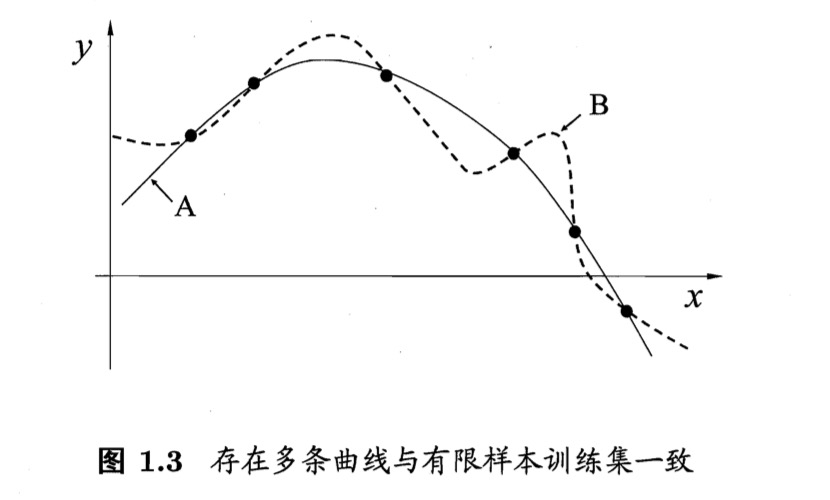

# 绪论
## 基本术语

机器学习致力于通过计算手段，利用经验（即已有数据）来改善自身的性能。机器学习研究的主要内容是从数据中产生“模型”算法，即学习算法。

 术语 | 解释 | 例子 
------|------|-------
样本（sample ）/示例（instance）/特征向量（feature vector）| 一个事件或对象 | 西瓜
数据集  样本的集合 | 若干个西瓜
特征（feature）/属性（attribute） | 事件或对象在某方面的性质 |  西瓜的“色泽”，“根蒂”，“敲声” 等
属性值 | 属性的取值 | “色泽”为“青绿”，“根蒂”为“蜷缩”
属性空间/样本空间/输入空间 | 各属性组成的空间 | 将 “色泽”，“根蒂”，“敲声”作为三个坐标轴，它们即组成一个用于描述西瓜的三维空间。
维数 | 属性的数目 | 如“色泽”，“根蒂”，“敲声”这三个属性用以描述西瓜成熟度，则维数为 3。
学习（learning）或训练（training）| 通过某个算法从数据中学得模型。 |
训练数据 | 训练过程中使用的数据 |
训练样本 | 训练数据中的每个样本 |
训练集  | 训练样本组成的集合|
标记（label） | 关于样本的信息 | 如将“色泽”为“青绿”，“根蒂”为蜷缩，“敲声”为浑浊的西瓜标记为好瓜。
样例（example）| 拥有标记信息的样本 | 
标记空间/输出空间 | 所有标记的集合 |
分类 | 预测类型是离散值 | 如“好瓜”、“坏瓜”。
回归 | 预测类型是连续值 | 如西瓜的成熟度。
二分类 | 只涉及两个类型的分类，通过称其中一个分类为“正类”，另外一个为“反类” | 如“好瓜”，“坏瓜”
多分类 | 涉及多个类型的分类 | 
测试 | 学得模型后，使用该模型进行预测的过程 | 
测试样本 | 用于测试的样本 | 
聚类 | 将训练集中的样本集分成若干组，每组称为一个“簇”（cluster） |
监督学习（supervised learning） | 训练数据有标记信息 | 代表：分类和回归
无监督学习（unsupervised learning）| 训练数据无标记信息 | 代表：聚类
泛化（generalization） | 模型适用于新样本的能力 |
假设 | 训练后的结果，即学得模型 | 如好瓜的假设 =（“色泽”= * ）^ （“根蒂”=蜷缩）^ （“敲声”= * ） 
假设空间 | 所有可能假设组成的空间 | 如好瓜的假设 =（“色泽”= * ）^ （“根蒂”= * ）^  （“敲声”= * ）

## 归纳偏好

一般而言，通过学习可能产生多个与训练集一致的假设，但它们在面对新样本时，会产生不同的输出。如图：

任何一个有效的机器学习算法必有其归纳偏好。那么有没有一般性的原则来引导算法建立“正确的”的偏好呢？“奥卡姆剃刀”（Occam's razor）是一种常用的、自然科学研究中最基本的科学，即**若有多个假设与观察一致，则选最简单的那个**。

然而，“奥卡姆剃刀”并非唯一可行的原则，对于一个学习算法 A，若在某些问题上比学习算法 B 好，则必然存在另外一些问题，使得算法 B 要好于算法 A。不过很多时候我们只关注自己正在试图解决的问题，对于这个问题的解决方案，我们不关心该解决方案在别的相似的问题上是否为好方案。所以在谈论算法优劣时，必须针对具体的学习问题，学习算法自身的归纳偏好与问题是否相配，往往起到决定性的作用。

